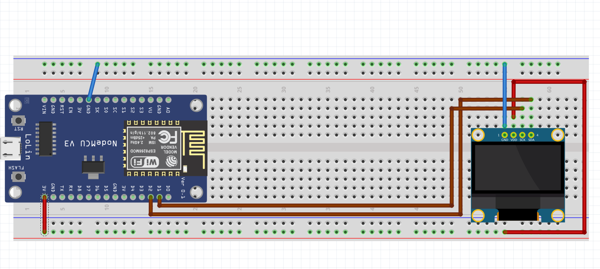

# ESP8266-Phishing-Access-Point
 Create a phishing access point using an ESP8266
For the moment, i have the esp8266 in access point mode with a working network. I display some info on a small oled screen (mac address, ip...)
I will now be working on storing images on the esp8266 (using SPIFF apparently ?) and on retrieving valuable data on the connected clients.

Basic circuit that looks like this for now :

